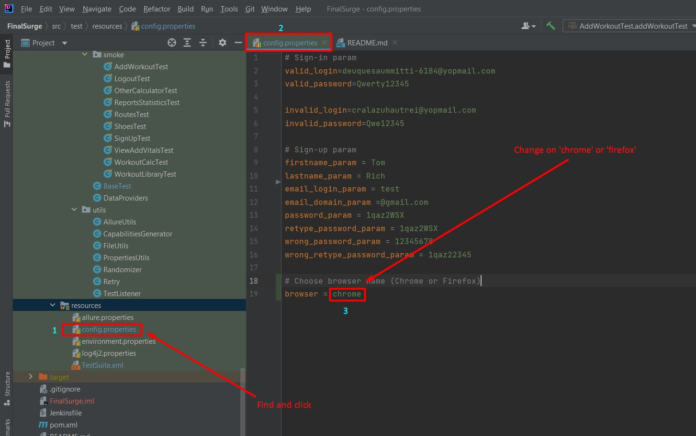

# Website: [FinalSurge](https://log.finalsurge.com/)

### Foreword:
Our framework is **crossbrowser**. Therefore, if you want to use a specific browser,
then you need to change the name of the browser in the code: (Image 1)
  


### TestNg command for run
**Command to run all tests:**
```
mvn clean test
```
**Command to run Smoke tests:**
```
mvn clean test -Dgroups="smoke"
```
**Command to run Negative tests:**
```
mvn clean test -Dgroups="negative"
```
  
### Allure command for run
**Command to run Allure on browser:**
```
mvn allure:serve
```
**Command to run Allure on project:**
```
mvn allure:report
```
  
### Tests documentation

| ID  | Pages            | Cases                                                               | Who did | Status | 
|-----|------------------|---------------------------------------------------------------------|---------|--------|
| 1   | Login            | Login page loaded                                                   | Vlad    | Done   |
| 2   | Login            | Sign in with valid credential                                       | Vlad    | Done   |
| 3   | Login            | Sign in with invalid credential                                     | Vlad    | Done   |
| 4   | Login            | Sign in with invalid 'Email' and valid 'Password'                   | Vlad    | Done   |
| 5   | Login            | Sign in with valid 'Email' and invalid 'Password'                   | Vlad    | Done   |
| 6   | Login            | Sign in with empty 'Email' and 'Password' fields                    | Vlad    | Done   |
| 7   | Login            | Sign in with empty 'Email' field                                    | Vlad    | Done   |
| 8   | Login            | Sign in with empty 'Password' field                                 | Vlad    | Done   |
| 9   | Login            | Login button display                                                | Vlad    | Done   |
| 10  | Login            | Check that 'Not registered? Sign up here for free' link is working  | Nadya   | Done   |
| 11  | Register         | Sign up with valid credential                                       | Nadya   | Done   |
| 12  | Register         | Sign up with empty 'Email'                                          | Nadya   | Done   |
| 13  | Register         | Sign up with empty 'Password'                                       | Nadya   | Done   |
| 14  | Register         | Sign up with empty 'Re-type password'                               | Nadya   | Done   |
| 15  | Register         | Sign up with empty 'First Name'                                     | Nadya   | Done   |
| 16  | Register         | Sign up with empty 'Last Name'                                      | Nadya   | Done   |
| 17  | Register         | Sign up with password which doesn't match the rule                  | Nadya   | Done   |
| 18  | Register         | Sign up: password doesn't match retype password                     | Nadya   | Done   |
| 19  | Home             | Header option display                                               | Vlad    | Done   |
| 20  | Home             | Home page loaded                                                    | Vlad    | Done   |
| 21  | Home             | Breadcrumbs display                                                 | Vlad    | Done   |
| 22  | Add Workout      | 'Add Workout' page loaded                                           | Vlad    | Done   |
| 23  | Add Workout      | Breadcrumbs display                                                 | Vlad    | Done   |
| 24  | Add Workout      | Sidebar with activity display                                       | Vlad    | Done   |
| 25  | Add Workout      | Choose any activity type from sidebar                               | Vlad    | Done   |
| 26  | Add Workout      | Form display                                                        | Vlad    | Done   |
| 27  | Add Workout      | Fields displayed                                                    | Vlad    | Done   |
| 28  | Add Workout      | 'Submit' button display                                             | Vlad    | Done   |
| 29  | Add Workout      | Add workout with valid data                                         | Vlad    | Done   |
| 30  | Workout Details  | 'Workout Details' page loaded                                       | Vlad    | Done   |
| 31  | Workout Details  | Check that added workout value matched                              | Vlad    | Done   |
| 32  | Reports          | Opening "Reports & Statistics" page from the main menu              | Nadya   | Done   |
| 33  | Reports          | Displaying the report when only the period is selected              | Nadya   | Done   |
| 34  | Reports          | Displaying the report when all filters are selected                 | Nadya   | Done   |
| 35  | Reports          | Check that the data in the table match the selected period          | Nadya   | Done   |
| 36  | Reports          | Check that the data in the table match the selected period and type | Nadya   | Done   |
| 37  | Reports          | 'Report & Statistics' page loaded                                   | Nadya   | Done   |
| 38  | Reports          | 'View Report' button is displayed                                   | Nadya   | Done   |
| 39  | Reports          | Breadcrumbs display                                                 | Nadya   | Done   |
| 40  | Workout Library  | 'Workout Library' page loaded                                       | Vlad    | Done   |
| 41  | Workout Library  | Breadcrumbs display                                                 | Vlad    | Done   |
| 42  | Workout Library  | Form display                                                        | Vlad    | Done   |
| 43  | Workout Library  | Fields display                                                      | Vlad    | Done   |
| 44  | Workout Library  | 'Add Workout' button display                                        | Vlad    | Done   |
| 45  | Workout Library  | Check that added workout value matched                              | Vlad    | Done   |
| 46  | Workout Library  | Table display wit data                                              | Vlad    | Done   |
| 47  | Shoes            | 'Shoes' page loaded                                                 | Vlad    | Done   |
| 48  | Shoes            | Breadcrumbs display                                                 | Vlad    | Done   |
| 49  | Shoes            | Form display                                                        | Vlad    | Done   |
| 50  | Shoes            | Fields display                                                      | Vlad    | Done   |
| 51  | Shoes            | 'Add Shoe' button display                                           | Vlad    | Done   |
| 52  | Shoes            | Table display with data                                             | Vlad    | Done   |
| 53  | Shoes            | Check that added workout value matched                              | Vlad    | Done   |
| 54  | Daily Vital      | 'View & Add Vitals' page loaded                                     | Nadya   | Done   |
| 55  | Daily Vital      | 'Add Vitals' button is displayed                                    | Nadya   | Done   |
| 56  | Daily Vital      | Check that the fiels for adding vilals are displayed                
|     |                  | after clicking the button 'Add Vitals'                              | Nadya   | Done   |
| 57  | Daily Vital      | Add new vital                                                       | Nadya   | Done   |
| 58  | Daily Vital      | Choose the period for 'Daily Vitals' table                          | Nadya   | Done   |
| 59  | Daily Vital      | 'View' button is displayed                                          | Nadya   | Done   |
| 60  | Daily Vital      | Table with data is displayed                                        | Nadya   | Done   |
| 61  | Daily Vital      | Check that entered data matches the data in the table               | Nadya   | Done   |
| 62  | Routes           | 'Routes' page loaded                                                | Vlad    | Done   |
| 63  | Routes           | Breadcrumbs display                                                 | Vlad    | Done   |
| 64  | Routes           | Form display                                                        | Vlad    | Done   |
| 65  | Routes           | Fields display                                                      | Vlad    | Done   |
| 66  | Routes           | 'Add Route' button display                                          | Vlad    | Done   |
| 67  | Routes           | Table display wit data                                              | Vlad    | Done   |
| 68  | Routes           | Check that added workout value matched                              | Vlad    | Done   |
| 69  | Workout calc     | Open the frame 'Workout calculator'                                 | Nadya   | Done   |
| 70  | Workout calc     | Check that calculator works                                         | Nadya   | Done   |
| 71  | Workout calc     | Check the message if the value of minutes isn't entered             | Nadya   | Done   |
| 72  | Workout calc     | Check the message if the value of seconds isn't entered             | Nadya   | Done   |
| 73  | Workout calc     | Check the message if the event doesn't match the time               | Nadya   | Done   |
| 74  | Other Calculator | Open the frame 'Workout calculator'                                 | Vlad    | Done   |
| 75  | Other Calculator | Check that calculator works                                         | Vlad    | Done   |
| 76  | Other Calculator | Fields display                                                      | Vlad    | Done   |
| 77  | Other Calculator | 'Calculate Paces' button display                                    | Vlad    | Done   |
| 78  | Other Calculator | Check that calculator works                                         | Vlad    | Done   |
| 79  | Other Calculator | Check that added calc data matched                                  | Vlad    | Done   |
| 80  | Home             | Menu display                                                        | Vlad    | Done   |
